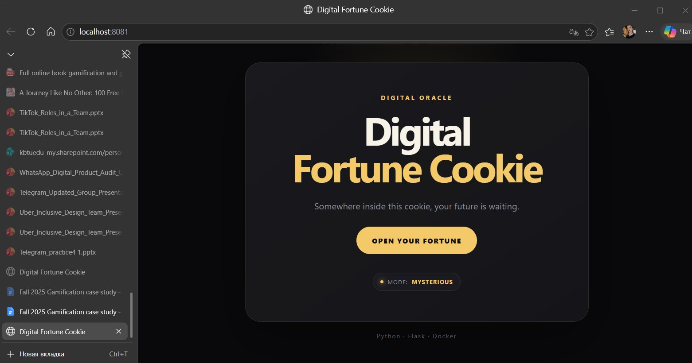
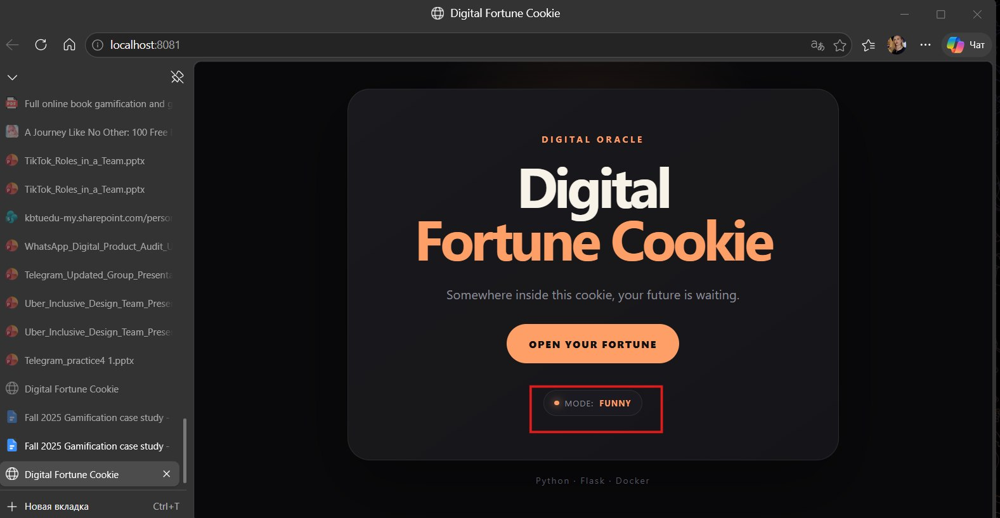
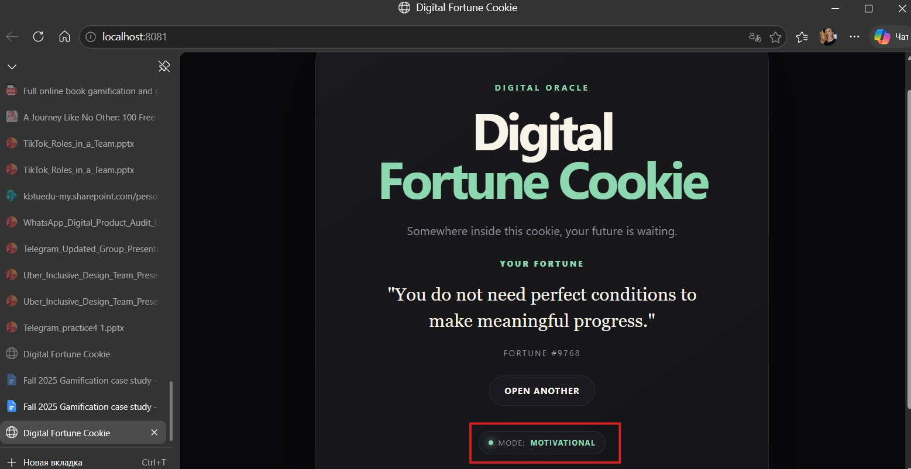
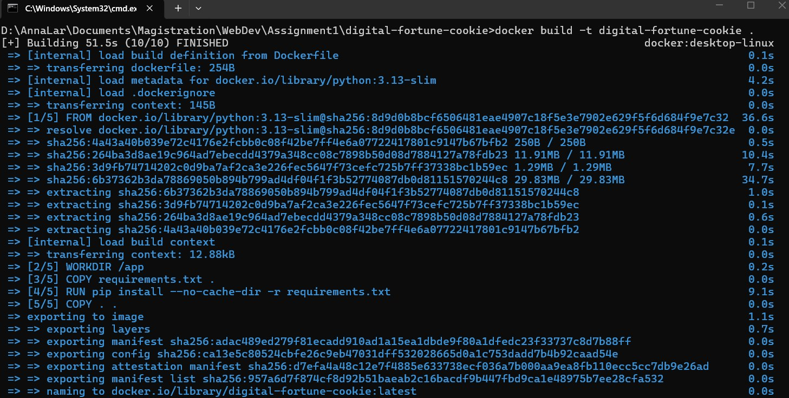
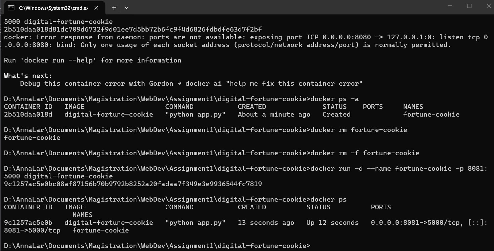
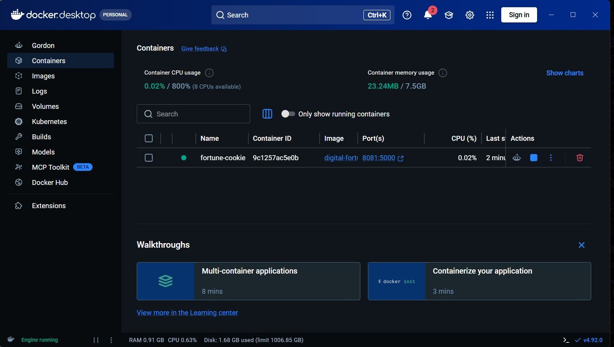
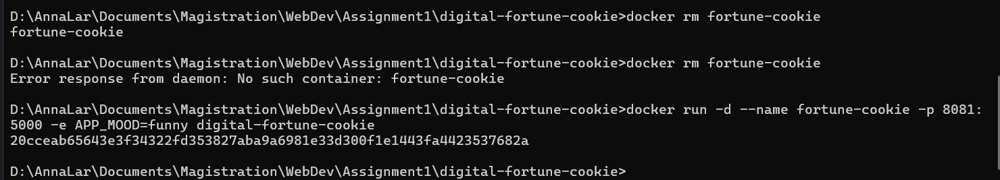
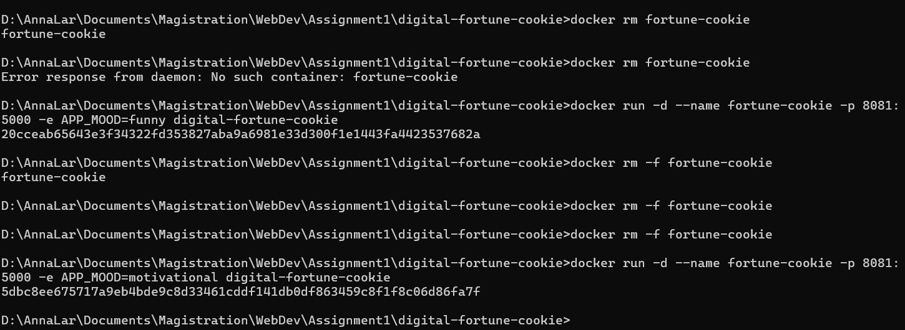
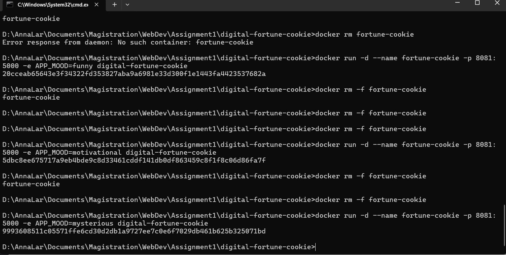

# 🥠 Digital Fortune Cookie

<p align="center">
  <strong>A small containerized web application built with Python, Flask and Docker.</strong>
</p>

<p align="center">
  Open a digital fortune cookie and discover what the future has prepared for you.
</p>

<p align="center">
  <code>Python</code> •
  <code>Flask</code> •
  <code>HTML</code> •
  <code>CSS</code> •
  <code>JavaScript</code> •
  <code>Docker</code>
</p>

---

## ✦ About the Project

**Digital Fortune Cookie** is a simple web application I created to practice containerizing a web application with **Docker**.

The application allows the user to open a virtual fortune cookie and receive a randomly selected fortune generated by the Python backend.

The interesting part is that the application's behavior can be changed **without modifying its source code**.

Using the `APP_MOOD` environment variable, the same Docker image can run in three different modes:

| Mode             | Description                                |
| ---------------- | ------------------------------------------ |
| 🌙 `mysterious`  | Mysterious and cryptic predictions         |
| 😄 `funny`       | Funny developer and everyday-life fortunes |
| ✨ `motivational` | Positive and motivational messages         |

This project demonstrates Docker images, containers, port mapping, environment variables, Dockerfile instructions, build context, image layers and basic Docker optimization practices.

---

# ✦ Application Preview

## 🌙 Mysterious Mode

```bash
-e APP_MOOD=mysterious
```

<p align="center">
  
</p>


---

## 😄 Funny Mode

```bash
-e APP_MOOD=funny
```

<p align="center">
  
</p>

---

## ✨ Motivational Mode

```bash
-e APP_MOOD=motivational
```

<p align="center">
  
</p>

---

# ✦ How It Works

The application consists of a simple frontend and a Flask backend.

When the user presses **OPEN YOUR FORTUNE**, JavaScript sends a request to:

```text
GET /api/fortune
```

The Flask backend checks the current `APP_MOOD` environment variable, selects the corresponding collection of fortunes and randomly chooses one of them.

The generated fortune is returned to the browser as JSON.

Example:

```json
{
  "fortune": "Small progress is still progress.",
  "mood": "motivational",
  "id": 4281
}
```

The frontend then displays the fortune without reloading the page.

### Application flow

```text
User
  │
  │ clicks "OPEN YOUR FORTUNE"
  ▼
JavaScript Frontend
  │
  │ GET /api/fortune
  ▼
Flask Backend
  │
  │ reads APP_MOOD
  ▼
┌─────────────────────────────┐
│ mysterious                  │
│ funny                       │
│ motivational                │
└─────────────────────────────┘
  │
  │ random.choice(...)
  ▼
JSON Response
  │
  ▼
Fortune displayed in browser
```

---

# ✦ Docker Architecture

The Flask application listens on **port 5000 inside the Docker container**.

I publish the application on another port on the host machine using Docker port mapping.

For example:

```bash
-p 8081:5000
```

means:

```text
HOST                         DOCKER CONTAINER

localhost:8081
      │
      │
      ▼
┌─────────────┐             ┌─────────────────────┐
│ Port 8081   │ ──────────► │ Port 5000           │
│             │             │                     │
│ Host        │             │ Flask Application   │
└─────────────┘             └─────────────────────┘

        8081 : 5000
        HOST   CONTAINER
```

Therefore, after starting the container, the application can be opened at:

```text
http://localhost:8081
```

---

# ✦ Project Structure

```text
digital-fortune-cookie/
│
├── static/
│   ├── script.js
│   └── style.css
│
├── templates/
│   └── index.html
│
├── screenshots/
│   ├── docker-build.jpg
│   ├── docker-run.jpg
│   ├── docker-container.jpg
│   ├── docker-mysterious-mode.jpg
│   ├── mysterious-mode.jpg
│   ├── docker-funny-mode.jpg
│   ├── funny-mode.jpg
│   ├── docker-motivational-mode.jpg
│   └── motivational-mode.jpg
│
├── .dockerignore
├── .gitignore
├── app.py
├── Dockerfile
├── README.md
└── requirements.txt
```

### Main files

**`app.py`**
Contains the Flask backend, API endpoints, fortune collections and environment variable configuration.

**`templates/index.html`**
Contains the main HTML structure of the application.

**`static/style.css`**
Contains the visual design and different accent colors for each mood.

**`static/script.js`**
Requests fortunes from the Flask API and updates the interface dynamically.

**`requirements.txt`**
Contains the Python dependencies required by the application.

**`Dockerfile`**
Contains the instructions used to build the Docker image.

**`.dockerignore`**
Prevents unnecessary local files from being included in the Docker build context.

---

# ✦ Environment Variables

The application uses environment variables for configuration.

## `APP_MOOD`

Controls the type of fortunes generated by the application.

Supported values:

```text
mysterious
funny
motivational
```

The default value defined in the Dockerfile is:

```dockerfile
ENV APP_MOOD=mysterious
```

It can be overridden when creating a container:

```bash
docker run -e APP_MOOD=funny ...
```

This allows me to change the application's behavior **without changing the source code or rebuilding the Docker image**.

---

## `PORT`

The application uses:

```dockerfile
ENV PORT=5000
```

and Flask reads it using:

```python
PORT = int(os.getenv("PORT", "5000"))
```

This keeps the application's internal port configurable.

---

# ✦ Dockerfile

The project uses the following Dockerfile:

```dockerfile
FROM python:3.13-slim

WORKDIR /app

COPY requirements.txt .

RUN pip install --no-cache-dir -r requirements.txt

COPY . .

ENV PORT=5000
ENV APP_MOOD=mysterious

EXPOSE 5000

CMD ["python", "app.py"]
```

### Dockerfile instructions

| Instruction | Purpose                                                         |
| ----------- | --------------------------------------------------------------- |
| `FROM`      | Defines the base Python image                                   |
| `WORKDIR`   | Sets `/app` as the working directory inside the image           |
| `COPY`      | Copies project files into the image                             |
| `RUN`       | Installs Python dependencies during the image build             |
| `ENV`       | Defines default environment variables                           |
| `EXPOSE`    | Documents the port used by the application inside the container |
| `CMD`       | Defines the command executed when the container starts          |

---

# ✦ Docker Optimization

I used several basic optimization practices in the Docker configuration.

### 1. Slim base image

```dockerfile
FROM python:3.13-slim
```

The `slim` Python image contains fewer unnecessary packages than the full Python image, helping reduce the final image size.

### 2. Dependency layer caching

Instead of copying the entire project immediately, I first copy only:

```dockerfile
COPY requirements.txt .
```

and install the dependencies:

```dockerfile
RUN pip install --no-cache-dir -r requirements.txt
```

Only after that do I copy the application source code:

```dockerfile
COPY . .
```

This allows Docker to reuse the dependency installation layer when the application code changes but `requirements.txt` remains unchanged.

### 3. Disabled pip cache

```dockerfile
RUN pip install --no-cache-dir -r requirements.txt
```

`--no-cache-dir` prevents pip from storing its package download cache inside the Docker image.

### 4. `.dockerignore`

Unnecessary files such as the local virtual environment, Git metadata and Python cache files are excluded from the Docker build context.

Example:

```text
venv/
__pycache__/
*.pyc
.git/
.vscode/
.idea/
.env
```

---

# ✦ Build and Run

## 1. Clone the repository

```bash
git clone <YOUR-GITHUB-REPOSITORY-URL>
```

Move into the project directory:

```bash
cd digital-fortune-cookie
```

---

## 2. Build the Docker image

```bash
docker build -t digital-fortune-cookie .
```

The `-t` option gives the image the name:

```text
digital-fortune-cookie
```

The final `.` specifies the current directory as the Docker build context.

After building, the image can be checked with:

```bash
docker images
```

### Build result

<p align="center">
  
</p>

---

# ✦ Running the Application

## Default mode

Run the application using the default `mysterious` mode:

```bash
docker run -d --name fortune-cookie -p 8081:5000 digital-fortune-cookie
```

Then open:

```text
http://localhost:8081
```

---

## 🌙 Mysterious Mode

```bash
docker run -d \
  --name fortune-cookie \
  -p 8081:5000 \
  -e APP_MOOD=mysterious \
  digital-fortune-cookie
```

---

## 😄 Funny Mode

```bash
docker run -d \
  --name fortune-cookie \
  -p 8081:5000 \
  -e APP_MOOD=funny \
  digital-fortune-cookie
```

---

## ✨ Motivational Mode

```bash
docker run -d \
  --name fortune-cookie \
  -p 8081:5000 \
  -e APP_MOOD=motivational \
  digital-fortune-cookie
```

> Only one container named `fortune-cookie` should be running at a time. Remove the previous container before starting another mode.

---

# ✦ Managing the Container

### Show running containers

```bash
docker ps
```

### Show all containers

```bash
docker ps -a
```

### View application logs

```bash
docker logs fortune-cookie
```

### Stop the container

```bash
docker stop fortune-cookie
```

### Remove the container

```bash
docker rm fortune-cookie
```

### Stop and remove it in one command

```bash
docker rm -f fortune-cookie
```

---

# ✦ Changing the Application Mode

One Docker image can be used to create containers with different configurations.

For example, I can start the application in Funny Mode:

```bash
docker run -d --name fortune-cookie -p 8081:5000 -e APP_MOOD=funny digital-fortune-cookie
```

Then remove the container:

```bash
docker rm -f fortune-cookie
```

and start a new container from **the same image**:

```bash
docker run -d --name fortune-cookie -p 8081:5000 -e APP_MOOD=motivational digital-fortune-cookie
```

The application now generates motivational fortunes.

The Docker image itself does not need to be rebuilt because only the runtime configuration has changed.

### Container running successfully

<p align="center">
  
</p>
<p align="center">
  
</p>
<p align="center">
  
</p>
<p align="center">
  
</p>
<p align="center">
  
</p>

---

# ✦ Rebuilding After a Code Change

If the source code is changed, the Docker image needs to be rebuilt.

First, remove the old container:

```bash
docker rm -f fortune-cookie
```

Rebuild the image:

```bash
docker build -t digital-fortune-cookie .
```

Start a new container from the updated image:

```bash
docker run -d --name fortune-cookie -p 8081:5000 -e APP_MOOD=funny digital-fortune-cookie
```

The updated version is then available at:

```text
http://localhost:8081
```

This also demonstrates Docker layer caching: unchanged layers can be reused during the rebuild.

---

# ✦ Image vs Container

A **Docker image** is an immutable template containing the application, runtime, dependencies and configuration needed to create containers.

A **Docker container** is a running instance of an image.

```text
              Docker Image
          digital-fortune-cookie
                   │
          ┌────────┼────────┐
          │        │        │
          ▼        ▼        ▼
     Container  Container  Container
     Mysterious   Funny   Motivational
```

Multiple containers can therefore be created from the same image while using different environment variables.

---

# ✦ Useful Docker Commands

| Command                                    | Purpose                             |
| ------------------------------------------ | ----------------------------------- |
| `docker build -t digital-fortune-cookie .` | Build the image                     |
| `docker images`                            | Show Docker images                  |
| `docker run ...`                           | Create and start a container        |
| `docker ps`                                | Show running containers             |
| `docker ps -a`                             | Show all containers                 |
| `docker logs fortune-cookie`               | Show application logs               |
| `docker stop fortune-cookie`               | Stop the container                  |
| `docker rm fortune-cookie`                 | Remove the container                |
| `docker rm -f fortune-cookie`              | Force stop and remove the container |


---

<p align="center">
  <strong>🥠 Digital Fortune Cookie</strong>
</p>

<p align="center">
  <em>One image. Three moods. Infinite fortunes.</em>
</p>
